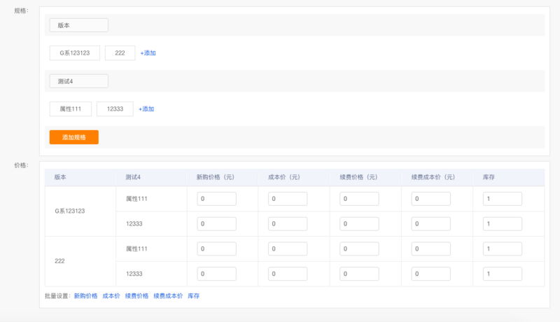
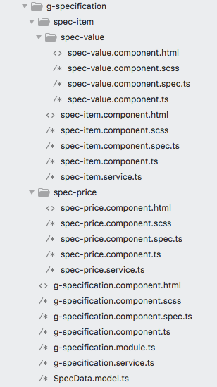
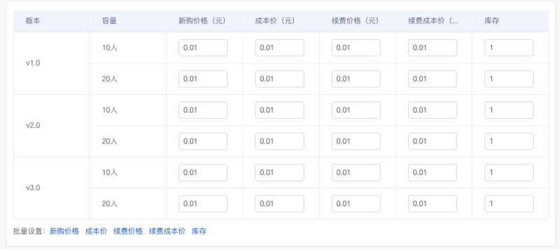
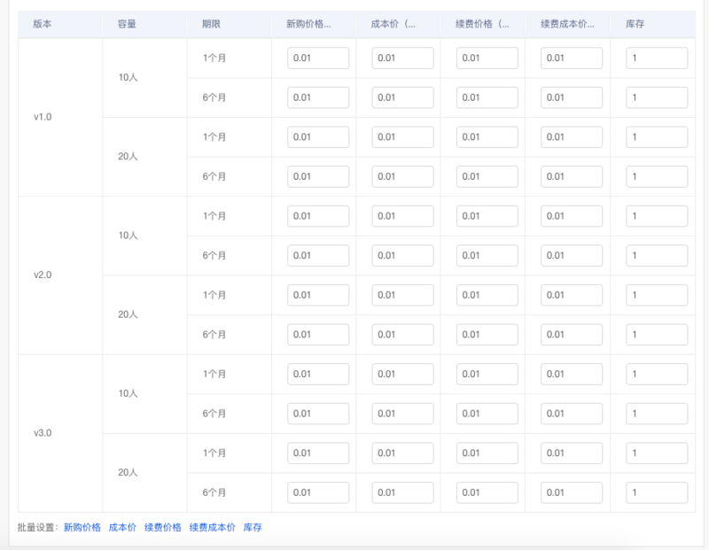

问题描述
----
我们在选购一件商品的时候通常都是需要选择相应的产品规格来计算价钱，不同规格的选择出来的价格以及库存数量都是不一样的，比如衣服就有颜色，尺码等属性

下面引用sku的概念

> 最小库存管理单元（Stock Keeping Unit, SKU）是一个会计学名词，定义为库存管理中的最小可用单元，例如纺织品中一个SKU通常表示规格、颜色、款式，而在连锁零售门店中有时称单品为一个SKU。最小库存管理单元可以区分不同商品销售的最小单元，是科学管理商品的采购、销售、物流和财务管理以及POS和MIS系统的数据统计的需求，通常对应一个管理信息系统的编码。 —— form wikipedia

那么我们在后台管理系统当中该如何去对商品的规格进行添加编辑删除，那么我们就需要设计一个sku规格生成组件来管理我们的产品规格设置

目标
--
在设计一个组件的时候我们需要知道最终要完成的效果是如何，需求是不是能够满足我们


如图中例子所示，我们需要设计类似这么一个可以无限级添加规格以及规格值，然后在表格里面设置产品价格和成本价库存等信息，最终便完成了我们的需求

分析
--

从大的方面说，规格和表格列表需要放在不同的组件里面，因为处理的逻辑不同
然后每一个规格都只能选择其下的规格值，且已经选过的规格不能再被选择，规格和规格值允许被删除，每一次规格的增删改都会影响着表格中的内容，但规格不受表格的影响，同时规格可以无限级添加....

尽可能的往多个方面考虑组件设计的合理性以及可能出现的情况

然后我们还需要知道后端那边需要我们前端传什么样的数据类型和方式（很重要）
假设后端需要的添加规格数据为

```typescript
{
    spec_format: Array<{
        spec_name: string;
        spec_id: number;
        value: Array<{
            spec_value_name: string,
            spec_value_id: number
        }>
    }> 
    
}
```
然后设置每一个规格价格和库存的数据为

```typescript
{
    skuArray: Array<{
	    attr_value_items: Array<{
            spec_id: number,
            spec_value_id: number
        }>;    
        price: number;
        renew_price: number;
        cost_renew_price?: number;
        cost_price?: number;
        stock: number;
    }>
}
```
这里我把目录分成如图



g-specification用来管理规格和表格的组件，想当于他们的父级
spec-price是设置价格库存等信息的表格组件
spec-item是规格
spec-value是其某个规格下的规格值列表选择组件

规格组件
--
我自己的个人习惯是喜欢把和视图有关的数据比如组件的显示与否，包括ngIf判断的字段等等单独放在一个ViewModel数据模型里，这样好和其他的接口提交数据区分开来，而且也便于后期其他人的维护，在这里我就不详细讲解视图上的逻辑交互了

首先创建一个SpecModel

```typescript
class SpecModel {
	'spec_name': string = ''
	'spec_id': number = 0

	'value': any[] = [] // 该规格对应的有的值

	constructor() {}

	/*
	赋值操作
	 */
	public setData( data: any ): void {
		this['spec_name'] = data['spec_name']!=undefined?data['spec_name']:this['spec_name']
		this['spec_name'] = data['spec_id']!=undefined?data['spec_id']:this['spec_id']
	}

	/*
	规格值赋值
	 */
	public setValue( data: any[] ): void {
		this['value'] = Array.isArray( data ) == true ? [...data] : []
	}

}
```
这里我定义了一个和后端所需要的spec_format字段里的数组子集一样的数据模型，每一个规格组件在创建的时候都会new一个这么一个对象，方便在g-specification组件里获取到多个规格组件里的SpecModel组装成一个spec_format数组

规格价格和库存设置组件
----
规格组件的设计因人而异，只是普通的数据传入和传出，组件之间的数据交互可能用Input or Output,也可以通过服务创建一个EventEmitter来交互，假设到了这里我们已经把规格组件和规格值列表组件处理完毕了并且通过g-specification.service这个文件来进行数据传输

在这个组件里我新创了一个SpecDataModel模型，作用是统一数据的来源，能够在spec-price组件里面处理的数据类型和字段不缺失或多余等

```typescript
export class SpecDataModel {

	'spec': any = {}
	'specValue': any[] = []

	constructor( data: any = {} ){

		this['spec'] = data['spec'] ? data['spec']: this['spec']
		this['specValue'] = data['specValue'] ? data['specValue'] : this['specValue']

		this['specValue'].map(_e=>_e['spec']=this['spec'])

	}

}
```
在这个服务里创建了一个EventEmitter来进行跨组件数据传递，主要传递的数据类型是SpecDataModel

```typescript
@Injectable()
export class GSpecificationService {

	public launchSpecData: EventEmitter<SpecDataModel> = new EventEmitter<SpecDataModel>()

	constructor() { }

}
```

在规格组件里面每一次的增加和删除都会next一次规格数据,图例列举了取消规格的操作
,每一次next的数据都会在spec-price组件里接收到
```typescript
	/*
	点击取消选中的规格值
	 */
	public closeSpecValue( data: any, index: number ): void {
		this.viewModel['_selectSpecValueList'].splice( index,1 )
		this.gSpecificationService.launchSpecData.next( this.launchSpecDataModel( this.viewModel['_selectSpecValueList'] ) )
		
	}

	/*
	操作完之后需要传递的值
	 */
	public launchSpecDataModel( specValue: any[], spec: SpecModel = this.specModel ): SpecDataModel {
		return new SpecDataModel( {'spec':spec,'specValue':[...specValue] } )
	}
```

然后在spec-price组件里就能接受其他地方传递进来的SpecDataModel数据

```typescript
	this.launchSpecRX$ = this.gSpecificationService.launchSpecData.subscribe(res=>{
		// res === SpecDataModel
	})
```


数据处理
-----
现在spec-price组件已经能够实时的获取到规格组件传递进来的数据了，包括选择的规格和规格值，那么
该如何处理这些数据使得满足图中的合并表格的样式以及将价格、成本价、和库存等信息数据绑定到所有规格里面，处理每一次的规格操作都能得到最新的SpecDataModel，显然是需要将这些SpecDataModel统一归并到一个数组里面，负责存放所有选择过的规格

显然还是需要在组件里面建立一个数据模型来处理接收过来的SpecDataModel，那么假定有一个_specAllData数组来存放所有规格

同时我们还观察到，图中的表格涉及到合并单元格，那么就需要用到tr标签的rowspan属性（还记得么？）

然后再次分析，发现不同数量的规格和规格值所出来的结果是一个全排列组合的情况

例：

> 版本： v1, v2, v3
容量： 10人，20人

那么出来的结果有3 X 2 = 6种情况，那么在表格当中呈现的结果就是六种，如果此时容量再多加一个规格值，那么结果就是3 X 3 = 9种情况
所以表格的呈现方式涉及到全排列算法和rowspan的计算方式

我们新建一个SpecPriceModel数据模型

```typescript
class SpecPriceModel {

	'_title': string[] = ['新购价格（元）','成本价（元）','续费价格（元）','续费成本价（元）','库存'] // 表格标题头部
	'_specAllData': any[] = [] // 所有规格传递过来的值

	private 'constTitle': string[] = [...this._title] // 初始的固定标题头


}
```
因为表格的最后5列是固定的标题头，而且每一次的规格添加都会增加一个标题头，那么就需要把标题头存放到一个变量里面
虽然_specAllData能接收到所有的规格但也有可能遇到重复数据的情况，而且当然所有的规格都被删除了之后，_specAllData也应该会一个空数组，所以在SpecPriceModel里面就需要对_specAllData去重

```
	public setAllSpecDataList( data: SpecDataModel ): void {
		if( data['specValue'].length > 0 ) {
			let _length = this._specAllData.length
			let bools: boolean = true
			for( let i: number = 0; i<_length; i++ ) {
				if( this._specAllData[i]['spec']['id'] == data['spec']['id'] ) {
					this._specAllData[i]['specValue'] = [...data['specValue']]
					bools = false
					break
				}
			}
			if( bools == true ) {
				this._specAllData.push( data )
			}
		}else {
			this._specAllData = this._specAllData.filter( _e=>_e['spec']['name'] != data['spec']['name'] )
		}
		this.setTitle()
	}

```

假设这个时候我们得到的_specAllData数据为

```json
[
    {
        spec:{
            name: '版本,
            id: 1
        },
        specValue:[
            {
                spec_value_id: 11,
                spec_value_name: 'v1.0'
            },
            {
                spec_value_id: 111,
                spec_value_name: 'v2.0'
            },
            {
                spec_value_id: 1111,
                spec_value_name: 'v3.0'
            }
        ]
    },
    {
        spec:{
            name: '容量,
            id: 2
        },
        specValue:[
            {
                spec_value_id: 22,
                spec_value_name: '10人'
            },
            {
                spec_value_id: 222,
                spec_value_name: '20人'
            }
        ]
    }
]
```
那么我们就剩下最后的合并单元格以及处理全排列组合的问题了，其实这个算法也有一个专业名词叫[笛卡尔积][1]

> 笛卡尔乘积是指在数学中，两个集合X和Y的笛卡尓积（Cartesian product），又称直积，表示为X × Y，第一个对象是X的成员而第二个对象是Y的所有可能有序对的其中一个成员

这里我用了递归的方法处理所有存在的按顺序的排列组合可能

```typescript
// 笛卡尔积
let _recursion_spec_obj = ( data: any )=>{

    let len: number = data.length
    if(len>=2){
        let len1 = data[0].length
        let len2 = data[1].length
        let newlen = len1 * len2
        let temp = new Array( newlen )
        let index = 0
        for(let i = 0; i<len1; i++){
            for(let j=0; j<len2; j++){
            	if( Array.isArray( data[0][i] ) ) {
	                temp[index]=[...data[0][i],data[1][j]]
            	}else {
	                temp[index]=[data[0][i],data[1][j]]
            	}
                index++
            }
        }
        let newArray = new Array( len-1 )
        for(let i=2; i<len; i++){
            newArray[i-1]= data[i]
        }
        newArray[0]=temp
        return _recursion_spec_obj(newArray)
    }
    else{
        return data[0]
    }

}
```
那么就能得到所有出现的排列组合结果，为一个二维数组，暂时就叫_mergeRowspan好了

```
[
    [
        {
            spec:{
                name: '版本',
                id: 1
            },
            spec_value_id: 11,
            spec_value_name: 'v1.0'
        },
        {
            spec:{
                name: '容量',
                id: 1
            },
            spec_value_id: 22,
            spec_value_name: '10人'
        }
    ]
    
    // ....等等
]
```
出现的结果有3 X 2 = 6种


而tr标签的rowspan属性是规定单元格可横跨的行数。

如图例



v1.0 横跨的行数为2，那么他的rowspan为2
10人和20人都是最小单元安么rowspan自然为1
可能图中的例子的行数比较少并不能直接的看出规律，那么这次来个数据多点的



这次 v1.0的rowspan为4
10人和20人的rowspan为2
。。。


那么我们就能得出，只要算出_mergeRowspan数组里面的每一个排列情况的rowspan值，然后在渲染表格的时候双向绑定到tr标签的rowspan就可以了

计算rowpsan
---------
举上图为例，总共有 3 X 2 X 2 = 12种情况，其中第一个规格的每一个规格值各占4行，第二个规格的每一个规格值各占2行，最后一个规格的规格值每个各占一行

```
this._tr_length = 1 // 全排列组合的总数
this._specAllData.forEach((_e,_index)=>{
	this._tr_length *= _e['specValue'].length
})
// 计算rowspan的值
let _rowspan_divide = 1
for( let i: number = 0; i<this._specAllData.length; i++ ) {
	_rowspan_divide *= this._specAllData[i]['specValue'].length
	for( let e: number = 0; e<this._specAllData[i]['specValue'].length; e++ ) {
		this._specAllData[i]['specValue'][e]['rowspan'] = (this._tr_length)/_rowspan_divide
	}
}
```
最终得到的数据如图


这里我们的每一条数据都能知道自己对应的rowspan的值是多少，这样在渲染表格的时候我们就能通过*ngIf来判断哪些该显示哪些不该显示。可能有的人会说，这个rowspan的拼接用原生DOM操作就可以了，那你知道操作这些rowspan需要多少行么。。

因为rowspan为4的占总数12的三分之一，所以只会在第一行和第五行以及第九行出现
rowspan为2的占总数12的六分之一，所以只会在第一、三、五、七、九、十一行出现
rospan为1的每一行都有

那么我们得出*ngIf的判断条件为 childen['rowspan']==1||(i==0?true:i%childen['rowspan']==0)

```
<tr *ngFor = "let list of tableModel['_mergeRowspan'];index as i">
	<ng-container *ngFor = "let childen of list['items'];index as e">
        <td class="customer-content"
    	    attr.rowspan="{{childen['rowspan']}}"
    	    *ngIf="childen['rowspan']==1||(i==0?true:i%childen['rowspan']==0)">
    	    {{childen['spec_value_name']}}
        </td>
	</ng-container>
</tr>
```

最后附完整的SpecPriceModel模型

```
class TableModel {

	'_title': string[] = ['新购价格（元）','成本价（元）','续费价格（元）','续费成本价（元）','库存']
	'_specAllData': any[] = [] // 所有规格传递过来的值
	/*
	合并所有的数据同时计算出最多存在的tr标签的情况
	需要用到二维数组
	一层数组存放总tr条数
	二层数组存放对象，该对象是所有规格按照排列组合的顺序排序同时保存该规格的rowpan值
	rowpan值的计算为，前一个规格 = 后面每个规格的规格值个数相乘
	 */
	'_mergeRowspan': any[] = [] 
	'_tr_length': number = 1 // tr标签的总数

	private 'constTitle': string[] = [...this._title] // 初始的固定标题头

	/*
	传递回来的规格数据处理
	 */
	public setAllSpecDataList( data: SpecDataModel ): void {
		if( data['specValue'].length > 0 ) {
			let _length = this._specAllData.length
			let bools: boolean = true
			for( let i: number = 0; i<_length; i++ ) {
				if( this._specAllData[i]['spec']['id'] == data['spec']['id'] ) {
					this._specAllData[i]['specValue'] = [...data['specValue']]
					bools = false
					break
				}
			}
			if( bools == true ) {
				this._specAllData.push( data )
			}
		}else {
			this._specAllData = this._specAllData.filter( _e=>_e['spec']['name'] != data['spec']['name'] )
		}
		this.setTitle()
	}

	/*
	设置标题头部
	 */
	private setTitle(): void {
		let _title_arr = this._specAllData.map( _e=> _e['spec']['name'] )
		this._title = [..._title_arr,...this.constTitle]
		this.handleMergeRowspan()
		
	}


	/****计算规格 合并表格单元*****/ 
	private handleMergeRowspan():void {
		this._tr_length = 1 // 全排列组合的总数
		this._specAllData.forEach((_e,_index)=>{
			this._tr_length *= _e['specValue'].length
		})
		// 计算rowspan的值
		let _rowspan_divide = 1
		for( let i: number = 0; i<this._specAllData.length; i++ ) {
			_rowspan_divide *= this._specAllData[i]['specValue'].length
			for( let e: number = 0; e<this._specAllData[i]['specValue'].length; e++ ) {
				this._specAllData[i]['specValue'][e]['rowspan'] = (this._tr_length)/_rowspan_divide
			}
		}
		// 笛卡尔积
		let _recursion_spec_obj = ( data: any )=>{

		    let len: number = data.length
		    if(len>=2){
		        let len1 = data[0].length
		        let len2 = data[1].length
		        let newlen = len1 * len2
		        let temp = new Array( newlen )
		        let index = 0
		        for(let i = 0; i<len1; i++){
		            for(let j=0; j<len2; j++){
		            	if( Array.isArray( data[0][i] ) ) {
			                temp[index]=[...data[0][i],data[1][j]]
		            	}else {
			                temp[index]=[data[0][i],data[1][j]]
		            	}
		                index++
		            }
		        }
		        let newArray = new Array( len-1 )
		        for(let i=2; i<len; i++){
		            newArray[i-1]= data[i]
		        }
		        newArray[0]=temp
		        return _recursion_spec_obj(newArray)
		    }
		    else{
		        return data[0]
		    }

		}
		let _result_arr = this._specAllData.map( _e=>_e['specValue'] )
		this._mergeRowspan = _result_arr.length == 1? (()=>{
			let result: any[] = []
			_result_arr[0].forEach(_e=>{
				result.push([_e])
			})
			return result || []
		})() : _recursion_spec_obj( _result_arr )

		// 重组处理完之后的数据，用于数据绑定
		if( Array.isArray( this._mergeRowspan ) == true ) {
			this._mergeRowspan = this._mergeRowspan.map(_e=>{
				return {
					items: _e,
					costData: {
						price: 0.01,
						renew_price: 0.01,
						cost_renew_price: 0.01,
						cost_price: 0.01,
						stock: 1
					}
				}
			})
		}else{
			this._mergeRowspan = []
		}

	}


}
```

相比于传统DOM操作rospan来动态合并表格的方式，这种通过计算规律和数据双向绑定的方式来处理不仅显得简短也易于维护

本文只是提炼了设计sku组件当中比较困难的部分，当然也只是其中的一个处理方式，这种方法不仅在添加规格的时候显得轻松，在编辑已有的规格也能轻松应对

  [1]: https://baike.baidu.com/item/%E7%AC%9B%E5%8D%A1%E5%B0%94%E4%B9%98%E7%A7%AF/6323173?fr=aladdin